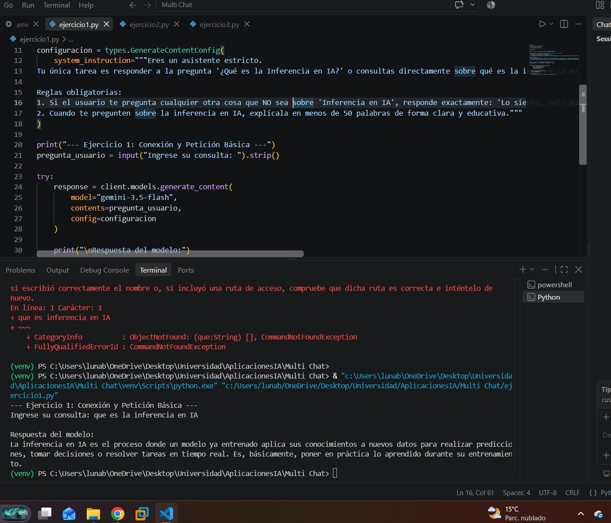
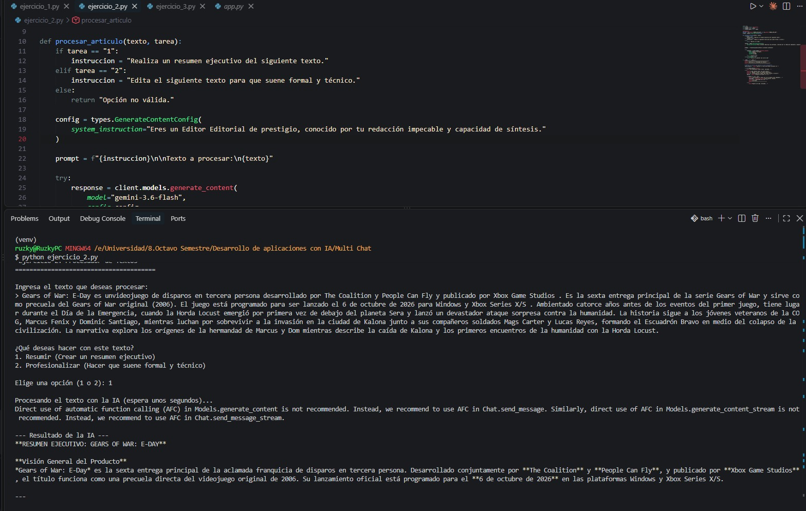

# Taller de Desarrollo de Aplicaciones con IA (Gemini)

Este repositorio contiene las soluciones para el taller de implementación de la API de Google Gemini, utilizando Python. El proyecto se compone de tres ejercicios interactivos que demuestran la generación de texto, asignación de roles (System Instructions) y mantenimiento de contexto (Few-Shot).

## Requisitos Previos

1. Tener instalado [Python](https://www.python.org/downloads/) (versión 3.9 o superior).
2. Tener una API Key de **Google AI Studio**.
3. Tener configurado el archivo `.env` en la raíz del proyecto.

### Configuración del archivo `.env`
Si no lo has hecho, asegúrate de que el archivo llamado `.env` contenga tu clave de la siguiente manera:
```env
GEMINI_API_KEY=Tu_Clave_De_Google_Aqui
```

## Configuración del Entorno de Desarrollo

Para evitar problemas con las librerías, es importante ejecutar el código dentro de un Entorno Virtual. Sigue estos pasos en tu terminal (VS Code, Git Bash o PowerShell):

### 1. Crear el Entorno Virtual
Para crear el entorno (que por convención se llama `venv`), ejecuta:
```bash
python -m venv venv
```

### 2. Activar el Entorno Virtual
Dependiendo de tu sistema operativo y terminal, el comando de activación varía:

* **Windows (Git Bash o MINGW64):**
  ```bash
  source venv/Scripts/activate
  ```
* **Windows (PowerShell):**
  ```powershell
  .\venv\Scripts\Activate.ps1
  ```
* **Windows (CMD clásico):**
  ```cmd
  venv\Scripts\activate.bat
  ```
* **Mac/Linux:**
  ```bash
  source venv/bin/activate
  ```
*(Sabrás que está activado si ves `(venv)` escrito al inicio de la línea en tu terminal).*

### 3. Instalar las Dependencias
Con el entorno virtual activado, instala todas las librerías necesarias ejecutando un solo comando:
```bash
pip install python-dotenv google-genai flask
```

---

## Cómo Ejecutar los Ejercicios

Cada ejercicio ha sido programado de forma interactiva. Asegúrate de tener tu entorno activado `(venv)` antes de intentar correr los comandos.

### Ejercicio 1: Conexión y Petición Básica
Un script que inicializa Gemini y aplica una regla estricta: responder a tu pregunta utilizando siempre **menos de 50 palabras**.
* **Comando para ejecutar:**
  ```bash
  python ejercicio_1.py
  ```
* **Instrucciones:** La terminal te pedirá que escribas una pregunta (por ejemplo: *"¿Qué es la Inferencia en IA?"*). Al presionar *Enter*, Gemini te responderá de forma directa.

### Ejercicio 2: Procesador de Textos Inteligente
Un programa que actúa como un "Editor Editorial de prestigio", permitiéndote procesar textos largos.
* **Comando para ejecutar:**
  ```bash
  python ejercicio_2.py
  ```
* **Instrucciones:** 
  1. La consola te pedirá que pegues o escribas un párrafo.
  2. Luego, te dará a elegir mediante números qué tarea deseas aplicar: `1` para generar un **Resumen Ejecutivo**, o `2` para **Profesionalizar** el texto (hacerlo formal y técnico).

### Ejercicio 3: Chat de Soporte con Historial (Few-Shot)
Un chatbot interactivo en tiempo real donde la IA asume el rol de un **vendedor amable de una tienda de tecnología**. Utiliza "Few-Shot" precargando un historial para darle contexto.
* **Comando para ejecutar:**
  ```bash
  python ejercicio_3.py
  ```
* **Instrucciones:** Se abrirá un chat en vivo. Puedes hacerle múltiples preguntas (recomendaciones de laptops, dudas sobre procesadores, etc.) y la IA recordará la conversación. Para salir del bucle del chat, simplemente escribe la palabra `finalizar`.

---
**Nota sobre los tiempos de respuesta:** Al presionar *Enter* en cualquiera de los ejercicios, la respuesta puede tardar entre **10 y 20 segundos** en llegar desde los servidores de Google. Verás mensajes como *"Procesando..."*, así que no te preocupes, el programa no se ha congelado, solo está esperando la respuesta.
---
**Evidencia:**
Ejercicio 1:


Ejercicio 2:



Ejercicio 3:


